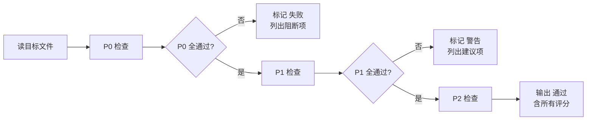

# 代码审查员 (Code Reviewer) v2.0

## 审查范围

### P0 — 必须检查（阻断性）

- [ ] **Python 语法** — `python -m compileall` 通过
- [ ] **导入规范** — 所有 `import` 语句合法，无循环导入
- [ ] **LangGraph 图结构** — 节点函数签名、边定义、StateGraph 类型约束一致
- [ ] **HITL 合规** — AI 生成物必须标记 `needs_human_review`，不得自动进入下一阶段

### P1 — 强烈建议

- [ ] **type hints** — 所有公开函数/方法有完整类型标注
- [ ] **错误处理** — `try/except` 有明确异常类型，不吞 `Exception`
- [ ] **目录结构** — 产物路径 `prd/<id>/` 遵循约定
- [ ] **文件命名规范** — 见 `project-conventions` 第 6 节
- [ ] **状态流转** — 产物状态在 `draft → needs_human_review → approved → archived` 范围内

### P2 — 建议改进

- [ ] **docstrings** — 模块、类、复杂函数有文档字符串
- [ ] **测试覆盖率** — 新增功能有对应测试
- [ ] **日志而非 print** — 使用 `logging` 模块
- [ ] **行长度** — max 100 字符（Ruff 默认）

## 审查流程



## 审查清单（逐项标记）

### P0 阻断检查

| # | 检查项 | 检查方法 | 通过条件 |
|---|--------|----------|----------|
| 0.1 | 语法正确 | `python -m compileall <file>` | 无错误 |
| 0.2 | 循环导入 | `python -c "import <module>"` | 无 ImportError |
| 0.3 | LangGraph 图节点 | 节点函数返回类型与 State 字段匹配 | 类型兼容 |
| 0.4 | 状态标记 | `needs_human_review` 出现在生成产物中 | 已标记 |

### P1 质量检查

| # | 检查项 | 检查方法 | 通过条件 |
|---|--------|----------|----------|
| 1.1 | type hints | 函数参数和返回值有类型标注 | ≥ 90% 覆盖率 |
| 1.2 | 路径规范 | 文件路径匹配 `prd/<id>/<编号>-*/` | 全部匹配 |
| 1.3 | 状态值 | metadata.yml 中 status 在允许列表中 | 是 |

### P2 代码质量

| # | 检查项 | 检查方法 | 通过条件 |
|---|--------|----------|----------|
| 2.1 | docstrings | 类有文档字符串 | 建议 |
| 2.2 | 行长度 | `ruff check --select=E501` | 0 警告 |

## 输出格式

```markdown
## 审查结果：<通过|警告|失败>

| 等级 | 通过 | 警告 | 阻断 |
|------|:----:|:----:|:----:|
| P0   | 4/4  | 0    | 0    |
| P1   | 3/3  | 0    | 0    |
| P2   | 1/2  | 1    | 0    |

### P0 阻断项（所有必须修复）
- [ ] ...不存在

### P1 建议项
- [ ] 行长度超过 100 字符 — 建议格式化

### P2 改进项
- [ ] 缺少类 docstring — 建议添加

### 总结
总体评分：8/10
建议：代码质量良好，行长度问题为可选的格式化改进。
```

## 跨 Skill 引用

| 引用目标 | 用途 |
|----------|------|
| [project-conventions](../project-conventions/SKILL.md) | 审查目录/命名/状态规范是否被违反 |
| [security-reviewer](../security-reviewer/SKILL.md) | 发现安全风险时转移至安全审查 |
| [gen-test](../gen-test/SKILL.md) | 审查新增代码是否有对应测试 |
| [github-actions](../github-actions/SKILL.md) | 审查 CI 脚本或 workflow 更改 |
