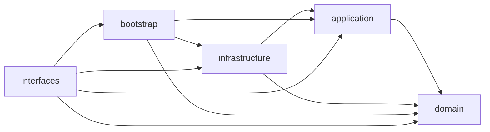
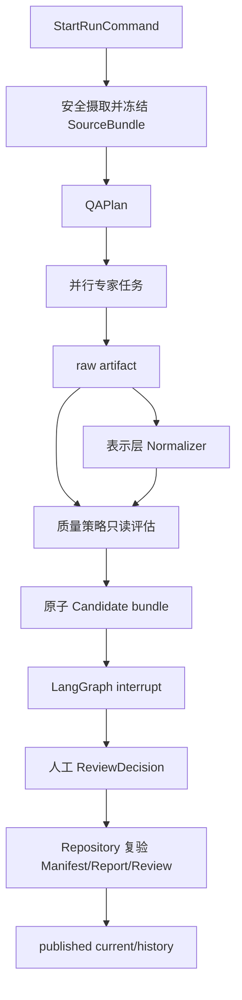

# Harness v2 架构

Agentic-QA 是单 Python distribution 的模块化单体。

## 实际依赖

架构测试严格限制 `domain` 和 `application` 的向外依赖。`interfaces` 是外层适配器：Facade 调用组合
根，并允许在构造参数中暴露具体注册表类型，因此不宣称它完全独立于 infrastructure。

| 区域 | 职责 | 可依赖 | 禁止 |
|---|---|---|---|
| `domain` | 公开领域模型、Review 纯规则、安全规则 | 标准库、Pydantic | application、infrastructure、LangGraph、SDK、存储 |
| `application` | 用例、端口、Source/Quality 输入模型 | domain | infrastructure、数据库、LangGraph、模型/MCP SDK |
| `infrastructure` | Workflow、仓储、模型、MCP、RAG、质量适配器 | application、domain | 反向成为公开契约 |
| `bootstrap.py` | 唯一生产组合根 | application、domain、infrastructure | 业务规则实现 |
| `interfaces` | `Harness` Facade 与 CLI | 组合根及所需契约/适配器类型 | LangGraph 类型进入命令契约 |

## Run 数据流

## 适配边界

| 能力 | application port / model | infrastructure adapter |
|---|---|---|
| 来源 | `SourceBundleRepository`、`SourceBundle` | 文件摄取与快照仓储 |
| 质量 | `QualityStrategy`、`ArtifactNormalizer` | 通用策略、注册表、业务 pack |
| 模型 | `ModelGateway` | OpenAI-compatible gateway |
| Checkpoint | `CheckpointProvider` | PostgreSQL saver |
| Tool | handler/manifest 契约 | API、RAG、PostgreSQL、MCP handlers |
| Artifact/Review | `ArtifactReviewRepository` | Candidate、Review、Publication Journal 文件仓储 |

业务 pack `city-opening-rewards` 仅存在于 infrastructure，并拆为 parser、rules、validators、
remediation、normalizer 和 strategy。LangGraph 只存在于 workflow adapter；PostgreSQL 是唯一生产
checkpoint，文件系统保存查询投影和不可变产物。
