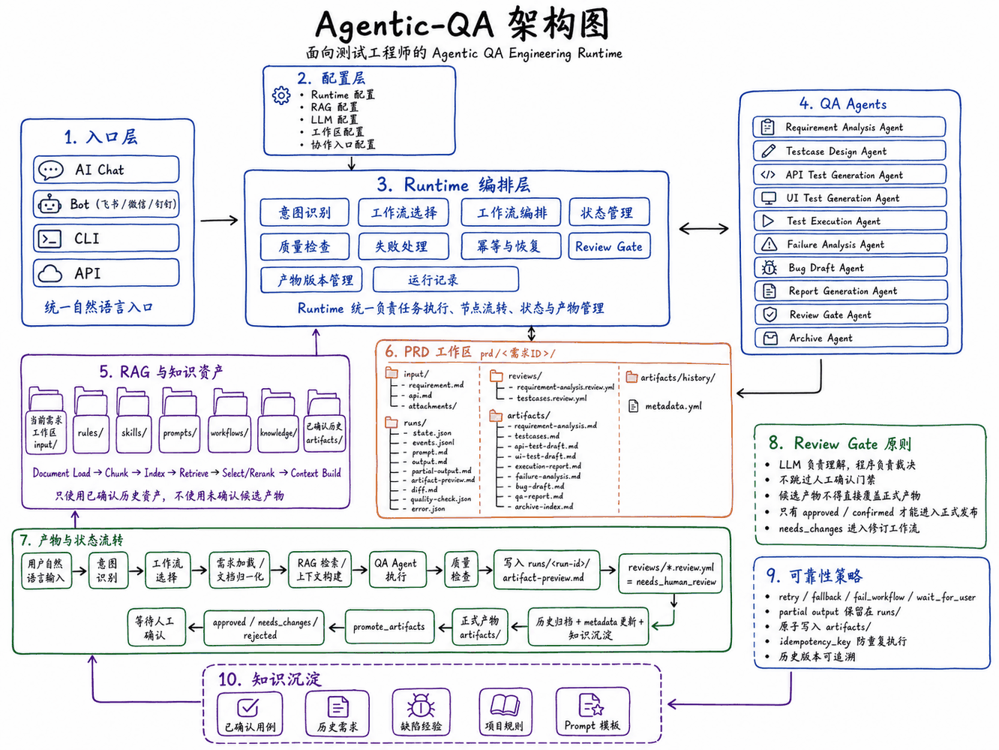

# Agentic-QA 架构说明



## 分层职责

Agentic-QA 通过统一 Runtime 把自然语言入口、Workflow DSL、RAG 上下文、QA Agent、质量检查、Review Gate 和产物发布串成可追踪的工程链路。

| 层级 | 职责 |
|---|---|
| 入口层 | 接收 Chat、Bot、CLI、API 等自然语言任务输入 |
| Intent Layer | 识别用户意图、需求来源和目标任务类型 |
| Workflow Orchestrator | 通过工作流注册表选择 WorkflowSpec，并驱动 LangGraph 执行 |
| Runtime Layer | 维护状态、运行记录、质量检查、失败处理、Review Gate 和产物版本 |
| RAG Pipeline | 完成文档加载、切分、索引、召回、排序、上下文构建和追踪 |
| QA Agent | 生成需求分析、测试用例、接口测试草稿、报告等候选产物 |
| Artifact Layer | 保存候选产物、正式产物、历史版本、review 记录和 metadata |

## 主链路

```text
自然语言输入
  ↓
Intent Layer
  ↓
Workflow Registry / Workflow DSL
  ↓
Runtime Orchestration
  ↓
RAG Context Build
  ↓
QA Agent Generation
  ↓
Quality Check
  ↓
Artifact Preview
  ↓
Review Gate
  ↓
Promote / Revise / Wait
```

## 边界约束

- 架构图放在 `docs/assets/`，不进入 `knowledge/`，避免污染业务 RAG 上下文。
- README 只保留架构入口和简要链路，详细说明放在本文件。
- AI 生成内容必须先进入候选产物和 Review Gate，不得直接覆盖正式产物。

## Runtime Graph Path

- Primary graph path: `workflows/runtime/*.workflow.yml` -> `runtime.workflow.loader` -> `runtime.workflow.builder` -> LangGraph.
- Facade entry points in `runtime.graph.app` must call the WorkflowSpec/MVP path for current workflows.
- No hard-coded graph compatibility path is kept in source.
- Runtime graph behavior must be changed through WorkflowSpec YAML, workflow builder code, or current MVP nodes only.
