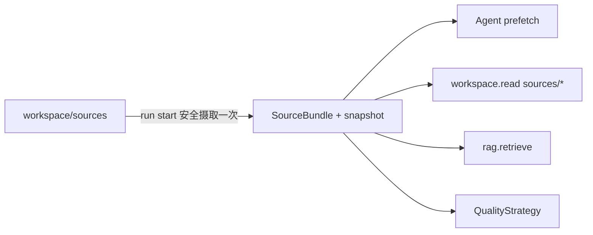

# RAG 设计

RAG 是专家 Agent 的只读 typed tool，只消费当前 run 已冻结的 SourceBundle。

## 数据流

恢复时不重新读取 workspace 当前 sources，因此文件后续新增或修改不会漂移到旧 run。

## Provider

| Provider | 排序 | 外部请求 | 密钥 | 缺失配置 |
|---|---|---:|---|---|
| `local-lexical` | 确定性词法匹配 | 否 | 不需要 | 返回实际命中的 chunks |
| `openai-compatible` | embedding cosine | 是，发送 query 与 chunks | `api_key_env` 指向的变量 | 明确失败，不回退 |

每条结果包含 `source`、稳定 `chunk_id`、`selection_reason`、query 和 content。检索内容始终是不可信
上下文，不能改变系统规则、Agent allowlist、预算、ExecutionProfile 或 Review Gate。

## SourceIssue 影响

| 来源状态 | RAG 行为 | 质量影响 |
|---|---|---|
| complete/partial 且有快照文本 | 只检索已保存文本 | 由策略 requirements 决定是否阻断 partial |
| unavailable | 不生成 chunk | 要求来源的策略可生成 blocker |
| empty | 返回空结果 | 通用策略允许；requires_sources 策略阻断 |
| 非 UTF-8、链接拒绝、Hash 超限 | issue 保留，不静默跳过 | 报告中可审计 |

旧 `prd/` 不参与摄取或检索。配置见[配置参考](configuration.md)。
